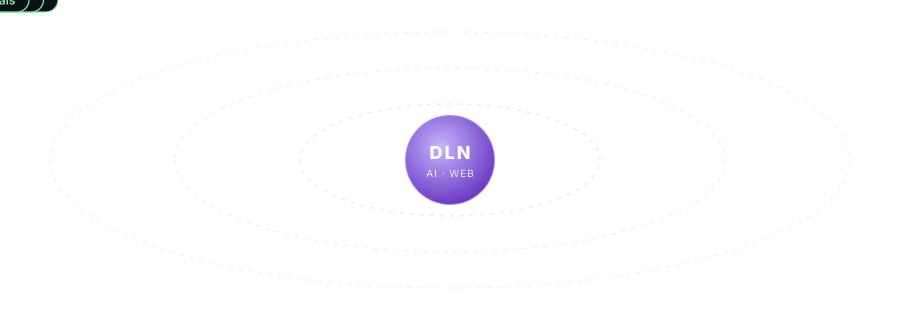

<!-- ===================== HEADER ===================== -->
<div align="center">
  
</div>

<!-- ===================== TYPING SVG ===================== -->
<div align="center">
  <a href="https://github.com/D-L-Narayana">
    
  </a>
</div>

<div align="center">
  <a href="https://github.com/D-L-Narayana"></a>
  <a href="https://linkedin.com/in/dlnarayana"></a>
  <a href="https://dln-portfolio.vercel.app"></a>
  <a href="mailto:nvr0910@gmail.com"></a>
</div>

<br/>

<div align="center">
  
</div>


<!-- ===================== ABOUT ===================== -->
## &nbsp;👨‍💻&nbsp; About Me

```yaml
name        : D L Narayana
location    : Visakhapatnam, India 🇮🇳
education   : B.Tech Computer Science & Engineering · GITAM · Class of 2027 · CGPA 7.97/10
role        : Data Engineer · Full-Stack Developer · AI Product Engineer
focus       : Production-grade data pipelines and web products — real-time CDC lakehouses, batch warehouses,
              analytics dashboards, and apps with LLMs built in
data        : Apache Spark (PySpark · Spark SQL · Structured Streaming) · Apache Kafka · Debezium (CDC) · Apache Airflow
              Parquet lakehouse (Bronze/Silver/Gold) · Star schema & SCD Type 2 · Data-quality gates & quarantine
              PostgreSQL · MongoDB · Docker Compose · pytest · JSON structured logging & pipeline metrics
stack       : TypeScript · React · Next.js · Node.js · Python · Java · SQL · Prisma · PostgreSQL · Tailwind
ai          : LLM integration · RAG pipelines · embeddings & vector search · AI agents · evals & guardrails
fundamentals: Data Structures & Algorithms · OOP · DBMS · Operating Systems · Computer Networks · System Design
exploring   : Databricks & Delta Lake · Snowflake · Hadoop / Hive · Kafka Streams · Data Contracts
principle   : idempotent pipelines, explicit schemas, tests for every transform, metrics for every run
```

<table align="center">
  <tr>
    <td align="center" width="50%">
      <h3>🚀 What I build</h3>
      <p>End-to-end <b>data pipelines</b> — CDC ingestion from Postgres through Debezium and Kafka into Spark Structured Streaming, batch ETL into star-schema warehouses with SCD Type 2 history, data-quality gates, Airflow orchestration and observable, idempotent jobs. Plus end-to-end <b>products</b>: authentication, REST APIs, relational data models and polished front-ends, increasingly with AI at the core.</p>
    </td>
    <td align="center" width="50%">
      <h3>💬 Ask me about</h3>
      <p>Spark internals (lazy evaluation, shuffles, broadcast joins, <code>foreachBatch</code>, checkpoints) · Kafka &amp; CDC semantics · dimensional modeling &amp; SCD2 · data-quality strategy · SQL window functions · Next.js &amp; React architecture · shipping LLM features to production — RAG, agents, evals · data visualization with Recharts.</p>
    </td>
  </tr>
</table>


<!-- ===================== TECH STACK ===================== -->
## &nbsp;🧰&nbsp; Tech Stack

<div align="center">
  
</div>

<div align="center">
  
  
  
  
  
  
  
  
</div>

<div align="center">
  
</div>


<!-- ===================== PROJECTS ===================== -->
## &nbsp;⭐&nbsp; Featured Projects

<div align="center">

<h3>🛠️ Data Engineering</h3>

| Project | What it does | Stack | Verified results | Links |
| :------ | :----------- | :---- | :--------------- | :---: |
| 🌊 **[LakeFlow — Real-Time CDC Lakehouse Pipeline](https://github.com/D-L-Narayana/lakeflow-cdc-pipeline)** | Streams PostgreSQL inserts/updates/deletes through Debezium and Kafka into Spark Structured Streaming; lands a Bronze → Silver → Gold Parquet lakehouse with idempotent upsert/delete merges, SCD Type 2 history, rule-based data-quality quarantine, batch backfill and an Airflow DAG | PySpark Structured Streaming · Kafka (KRaft) · Debezium · PostgreSQL · Parquet · Airflow · Docker Compose · pytest | 510,663 CDC events → Gold in **29.5 s** (~17K events/s) · 5,239 rows quarantined · exactly-once checkpointed sinks · 7 tests | [Repo](https://github.com/D-L-Narayana/lakeflow-cdc-pipeline) |
| 🏬 **[Retail Lakehouse ETL — Batch Data Warehouse](https://github.com/D-L-Narayana/retail-lakehouse-etl)** | Schema-enforced PySpark ETL over 1M+ semi-structured sales lines: corrupt-record capture, schema-drift detection, harmonization, window-function dedupe, an 8-rule DQ gate, a star-schema warehouse (SCD2 customer dimension with point-in-time joins, Hive-partitioned fact), Spark SQL marts and a MongoDB serving layer | PySpark · Spark SQL · Parquet · MongoDB · Airflow · pytest | 1,009,989 rows in **50.9 s** (~20K rows/s) · 981 corrupt lines caught · 9,993 duplicates removed · 1.3 % quarantined with per-rule breakdown · 5 tests | [Repo](https://github.com/D-L-Narayana/retail-lakehouse-etl) |

<h3>🧩 Full-Stack Applications</h3>

| Project | What it does | Stack | Live |
| :------ | :----------- | :---- | :--: |
| 🏙️ **[CityHelp](https://github.com/D-L-Narayana/cityhelp)** | Civic platform — report city issues, upvote, track on a real-time dashboard &amp; map, analytics on 7-day trends, category mix and department workload | Next.js · Supabase Realtime (PostgreSQL) · Recharts | [↗](https://cityhelp-sage.vercel.app) |
| 🏠 **[StayNest](https://github.com/D-L-Narayana/staynest)** | Airbnb-style booking marketplace — search &amp; filters, wishlists, booking flow with live price breakdown, host analytics (revenue, occupancy, ratings) on a normalized PostgreSQL schema | Next.js · TypeScript · PostgreSQL (Supabase) · Tailwind | [↗](https://staynest-two.vercel.app) |
| 🔎 **[GitHubLens](https://github.com/D-L-Narayana/githublens)** | Analyze any GitHub profile — stars, languages, top repos &amp; a developer score | Next.js · GitHub API · Recharts | [↗](https://githublens-kappa.vercel.app) |
| 🎮 **[CodeRunner](https://github.com/D-L-Narayana/coderunner)** | A code-typing game — race the clock on real snippets, build combos, climb the leaderboard | Next.js · React · Motion | [↗](https://coderunner-snowy.vercel.app) |

<h3>🎨 Frontend &amp; Tooling</h3>

| Project | What it does | Stack | Live |
| :------ | :----------- | :---- | :--: |
| 📄 **[ResumeForge](https://github.com/D-L-Narayana/resumeforge)** | Privacy-first career toolkit — live resume builder, real-time ATS scoring, PDF scanner, cover letters; everything runs in the browser | Vanilla JS · HTML · CSS | [↗](https://resumeforge-ruby-rho.vercel.app) |
| 📊 **[AlgoViz](https://github.com/D-L-Narayana/algoviz)** | DSA visualizer — 6 sorting + 4 pathfinding algorithms with live metrics | React · Vite · Motion | [↗](https://algoviz-lilac.vercel.app) |
| 🔐 **[CryptoLab](https://github.com/D-L-Narayana/cryptolab)** | Cryptography playground — classical ciphers + real Web Crypto (AES-GCM, RSA, hashing) | React · Vite · Web Crypto | [↗](https://cryptolab-six.vercel.app) |

</div>

<details>
<summary><b>How the data pipelines are built (design principles)</b></summary>

- **Bronze is immutable and schema-agnostic** — raw events are appended once with checkpointing; typing and business rules live downstream where they can be versioned and replayed.
- **Idempotency over promises** — merges use latest-per-key on the WAL commit order `(ts_ms, lsn)`, so replaying offsets or re-running a backfill yields identical tables.
- **Deletes and history are first-class** — `REPLICA IDENTITY FULL` before-images drive deletes; SCD Type 2 versions carry `effective_from / effective_to / is_current`.
- **Quality is a gate, not a filter** — failing rows go to a quarantine table with the rule names; runs and DAGs fail when the share crosses a threshold.
- **Everything observable** — JSON structured logs (ELK-ready), `StreamingQueryListener` throughput/latency, per-stage timings and run metrics files.
- **Same code for stream and batch** — one set of transforms powers `foreachBatch` streaming and nightly backfills, so one test suite covers both.
</details>


<!-- ===================== CONNECT ===================== -->
## &nbsp;🤝&nbsp; Let's Connect

<div align="center">
  <a href="https://github.com/D-L-Narayana"></a>
  <a href="https://linkedin.com/in/dlnarayana"></a>
  <a href="https://dln-portfolio.vercel.app"></a>
  <a href="mailto:nvr0910@gmail.com"></a>
</div>

<br/>

<div align="center">
  <i>"Build things that matter. Ship things that work."</i>
</div>

<div align="center">
  
</div>
