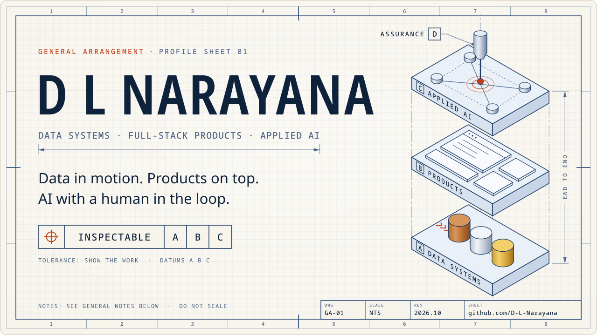
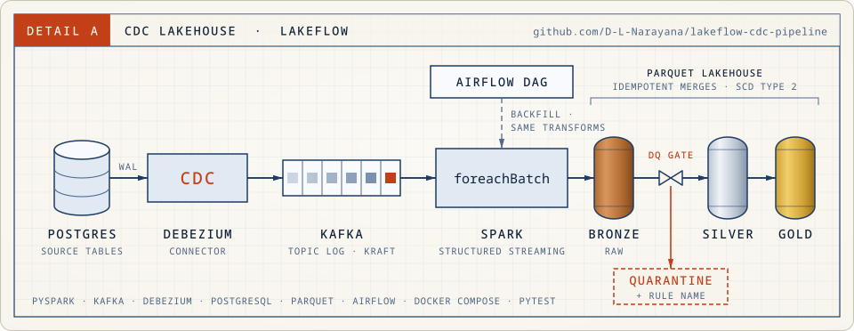
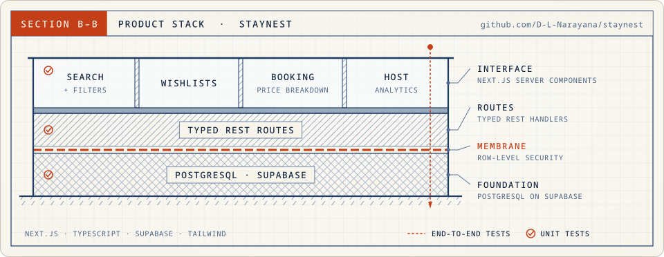
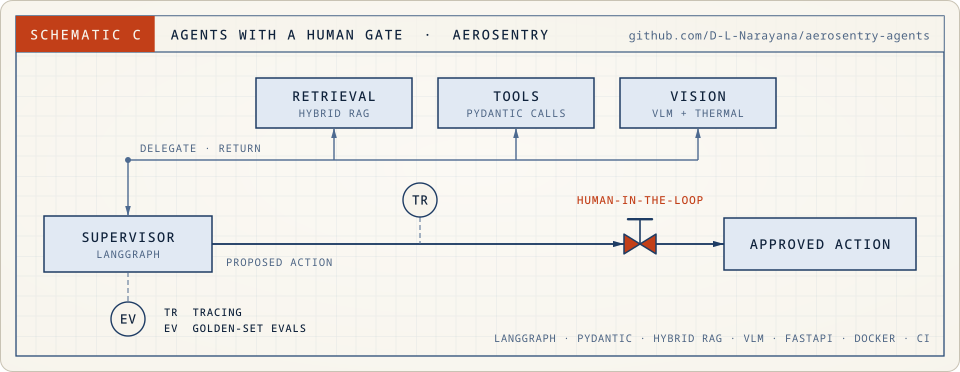

<!--
  Profile README for github.com/D-L-Narayana: a "general arrangement" drawing sheet.
  Every image is a local SVG in ./assets (light mode: whiteprint, dark mode: blueprint).
  No external images, badges, counters or scripts.
-->

<picture>
  <source media="(prefers-color-scheme: dark)" srcset="assets/hero-dark.svg">
  <source media="(prefers-color-scheme: light)" srcset="assets/hero-light.svg">
  
</picture>

**I'm D L Narayana**, a computer science undergraduate (B.Tech CSE, GITAM, class of 2027) in Visakhapatnam, India. I build **data systems** that move and model data, the **full-stack products** that sit on top of them, and **applied AI**, from agents with a human in the loop to models that run in the browser. I care most about work you can check: tests, synthetic data and stated limits, so you don't have to take a README's word for it.

**[Portfolio](https://dln-portfolio.vercel.app)** · **[LinkedIn](https://linkedin.com/in/dlnarayana)** · **[nvr0910@gmail.com](mailto:nvr0910@gmail.com)** · **[GitHub](https://github.com/D-L-Narayana)**

| Sheet | Contents |
| :-- | :-- |
| [**A** — Data systems](#a--data-systems) | CDC lakehouse, retail data series |
| [**B** — Full-stack products](#b--full-stack-products) | stay booking, reservations, civic tracker |
| [**C** — Applied AI](#c--applied-ai) | agents with a human gate, in-browser vision |
| [**D** — Assurance labs](#d--assurance-labs) | educational security and privacy labs |
| [General notes](#general-notes) | method, and how to read this page |

## A — Data systems

<picture>
  <source media="(prefers-color-scheme: dark)" srcset="assets/detail-a-lakeflow-dark.svg">
  <source media="(prefers-color-scheme: light)" srcset="assets/detail-a-lakeflow-light.svg">
  
</picture>

**[LakeFlow](https://github.com/D-L-Narayana/lakeflow-cdc-pipeline)** · real-time CDC lakehouse 
Row changes leave PostgreSQL through Debezium and Kafka. Spark Structured Streaming then lands them as Bronze → Silver → Gold Parquet, with idempotent upsert/delete merges, SCD Type 2 history, a rule-based quarantine for rows that fail quality checks, batch backfill and an Airflow DAG. 
PySpark · Kafka (KRaft) · Debezium · PostgreSQL · Parquet · Airflow · Docker Compose · pytest

**The retail series** covers one domain from the data warehouse to the stock shelf:

- **[Retail Lakehouse ETL](https://github.com/D-L-Narayana/retail-lakehouse-etl)**: schema-enforced PySpark batch ETL over semi-structured sales lines. It covers corrupt-record capture, schema-drift detection, deduplication, a data-quality gate, an SCD2 star-schema warehouse, Spark SQL marts and a MongoDB serving layer.
- **[RetailPulse](https://github.com/D-L-Narayana/retailpulse)**: window-function analytics in plain Python and SQL over a normalised SQLite schema, rendered to a static SVG dashboard, with zero dependencies.
- **[DemandCast](https://github.com/D-L-Narayana/demandcast)**: store-level demand forecasting with rolling-origin backtests for each series, safety stock sized from backtest error, and an (R, s, S) replenishment engine. It has tests and CI.
- **[StockLine](https://github.com/D-L-Narayana/stockline)**: a multi-store inventory and order API on FastAPI and SQLite, with atomic stock reservation, idempotent orders, optimistic locking and an append-only ledger.

## B — Full-stack products

<picture>
  <source media="(prefers-color-scheme: dark)" srcset="assets/section-b-staynest-dark.svg">
  <source media="(prefers-color-scheme: light)" srcset="assets/section-b-staynest-light.svg">
  
</picture>

**[StayNest](https://github.com/D-L-Narayana/staynest)** · stay booking, end to end · [demo](https://staynest-two.vercel.app) 
Search and filters, wishlists, a booking flow with a live price breakdown, and host analytics. It is built on Next.js server components, typed REST routes and Supabase Postgres with row-level security, and it has unit and end-to-end tests. 
Next.js · TypeScript · Supabase (PostgreSQL + RLS) · Tailwind

**[Lodgic](https://github.com/D-L-Narayana/lodgic)** · hotel search and reservation engine 
Written in TypeScript with no runtime dependencies. It has a segment-tree availability index, demand pricing with exact currency rounding, logistic-regression learning-to-rank, double-booking-safe idempotent reservations and an LRU/TTL cache, behind a REST API with an in-browser demo.

**[CityHelp](https://github.com/D-L-Narayana/cityhelp)** · civic issue tracker · [demo](https://cityhelp-sage.vercel.app) 
Report a city issue, upvote it and follow it on a live dashboard and map. Analytics show trends, category mix and department workload. 
Next.js · Recharts

## C — Applied AI

<picture>
  <source media="(prefers-color-scheme: dark)" srcset="assets/schematic-c-aerosentry-dark.svg">
  <source media="(prefers-color-scheme: light)" srcset="assets/schematic-c-aerosentry-light.svg">
  
</picture>

**[AeroSentry Agents](https://github.com/D-L-Narayana/aerosentry-agents)** · multi-agent operations layer designed for drone-in-a-box fleets 
A LangGraph supervisor delegates to specialist agents with hybrid RAG, Pydantic tool calling and VLM/thermal analysis. A human-in-the-loop safety gate sits between a proposed action and an approved one. The system adds a fallback protocol, tracing and golden-set evals. It is served with FastAPI, packaged with Docker and checked in CI.

**In-browser vision and forensics.** These projects run their analysis in the browser:

- **[VeriLens](https://github.com/D-L-Narayana/verilens)**: privacy-first KYC checks, covering face match, passive liveness, document OCR and tamper forensics on ONNX/WASM, with no inference APIs.
- **[VeriDoc Studio](https://github.com/D-L-Narayana/veridoc-studio)**: KYC document intelligence, with WASM OCR, Verhoeff checksum validation, error-level analysis and ONNX face detection.
- **[DocuForge](https://github.com/D-L-Narayana/docuforge)**: a document-forgery detection lab. It runs ELA, copy-move, noise, EXIF and JPEG forensics in the browser, plus a PyTorch research pipeline.
- **[AlterFrame](https://github.com/D-L-Narayana/alterframe)**: hold a window between your hands and reveal an illustrated alter ego, using browser-only hand and face tracking with WebGL2 stylization.

## D — Assurance labs

These are educational security and privacy labs built on synthetic data. Here inspection stops being a habit and becomes the subject.

- **[Cyber Assurance Lab](https://github.com/D-L-Narayana/cyber-assurance-lab)**: a suite of educational cybersecurity and privacy apps with synthetic fixtures, inspectable engines, tests, audit evidence and documented limits.
- **[Permit Matrix](https://github.com/D-L-Narayana/permit-matrix)**: an API-authorization lab that runs mixed test cases against a synthetic in-browser mock, with no external targets.
- **[Petitio](https://github.com/D-L-Narayana/petitio)**: a privacy-rights workflow with profile deadlines, guarded transitions, synthetic reconciliation and session audit hashing.
- **[Tessera CSF](https://github.com/D-L-Narayana/tessera-csf)**: a NIST CSF 2.0 evidence mapper using synthetic data and custom heuristics, running browser-local in React/TypeScript.

## General notes

Notes 1–6 describe how the pipelines are built. Notes 7–8 explain how to read this page.

1. **Raw stays raw.** Bronze is append-only and schema-agnostic. Typing and business rules live downstream, where they can be versioned and replayed.
2. **Idempotency over promises.** Merges keep the latest row per key in commit order, so replaying offsets or re-running a backfill yields identical tables.
3. **Deletes and history are first-class.** Before-images drive deletes. SCD Type 2 rows carry effective-from and effective-to dates and a current flag.
4. **Quality is a gate, not a filter.** Failing rows go to quarantine with the rule that caught them, and a run fails when too many do.
5. **Observable by default.** Every run has structured JSON logs, streaming-query metrics and per-stage timings.
6. **One transform, two modes.** The same code powers streaming micro-batches and backfills, so one test suite covers both.
7. **Do not scale.** Figures quoted inside individual repos are author-reported on specific workloads, not independent benchmarks. This page leaves them out on purpose.
8. **Scope.** This is personal and portfolio work, built as a student. Demo links are portfolio deployments, not production services. The assurance labs are built on synthetic data. Forks are other people's work, so they aren't listed.

## Toolbox

- **Languages:** Python · SQL · TypeScript · JavaScript
- **Data:** PySpark · Spark SQL · Structured Streaming · Kafka · Debezium · Airflow · Parquet · PostgreSQL · MongoDB · SQLite
- **Product:** React · Next.js · Node.js · FastAPI · Supabase · Tailwind · Recharts · Vite
- **AI:** LangGraph · hybrid RAG · Pydantic tool calling · VLMs · ONNX/WASM in the browser · PyTorch · golden-set evals
- **Practice:** pytest · unit and end-to-end tests · Docker Compose · CI · structured logging
- **Exploring:** Delta Lake · Databricks · Snowflake · Kafka Streams · data contracts

<b>More in the workshop</b>: analytics, tools, games and coursework

 

| Repo | What it is |
| :-- | :-- |
| [ABKit](https://github.com/D-L-Narayana/abkit) | A/B-testing and ranking-evaluation toolkit: z and Welch tests, power and sample size, SRM guardrail, CUPED, Holm/Bonferroni, NDCG/MRR and team-draft interleaving, validated by Monte-Carlo simulation |
| [Telecom KPI Monitor](https://github.com/D-L-Narayana/telecom-kpi-monitor) | NOC-style 4G LTE / 5G NR KPI, alarm and packet-statistics dashboard on a synthetic, seeded dataset |
| [Nova](https://github.com/D-L-Narayana/nova-ai-assistant) | no-signup AI chat assistant with server-side token streaming, expert personas, and Markdown and code rendering |
| [GitHubLens](https://github.com/D-L-Narayana/githublens) · [demo](https://githublens-kappa.vercel.app) | analyse a GitHub profile: stars, languages, top repos |
| [CodeRunner](https://github.com/D-L-Narayana/coderunner) · [demo](https://coderunner-snowy.vercel.app) | code-typing game: race the clock on real snippets and build combos |
| [ResumeForge](https://github.com/D-L-Narayana/resumeforge) · [demo](https://resumeforge-ruby-rho.vercel.app) | privacy-first career toolkit in plain HTML, CSS and JavaScript: resume builder, ATS scoring, PDF scanner, cover letters |
| [AlgoViz](https://github.com/D-L-Narayana/algoviz) · [demo](https://algoviz-lilac.vercel.app) | sorting and pathfinding visualiser with live metrics |
| [CryptoLab](https://github.com/D-L-Narayana/cryptolab) · [demo](https://cryptolab-six.vercel.app) | classical ciphers next to real Web Crypto: hashing, AES-GCM, RSA |
| [Spectra](https://github.com/D-L-Narayana/spectra) | palette and gradient generator with CSS, Tailwind and JSON export |
| [Typeflow](https://github.com/D-L-Narayana/typeflow) | minimal typing-speed test with live WPM and accuracy |
| [Stillpoint](https://github.com/D-L-Narayana/stillpoint) | generative focus environments with browser-generated soundscapes |
| [CAPSTONE](https://github.com/D-L-Narayana/CAPSTONE) | GITAM capstone: PSO-based 3D node localization for wireless sensor networks, with a Monte-Carlo study and a 3D swarm simulator |
| [Telstra cybersecurity simulation](https://github.com/D-L-Narayana/forage-telstra-cybersecurity-job-simulation) | Forage virtual job simulation, an exercise rather than employment: alert triage, firewall-log analysis, a Python firewall rule and an incident postmortem |
| [Skyscanner flight schedule](https://github.com/D-L-Narayana/skyscanner-flight-schedule) | Forage virtual job simulation, an exercise rather than employment: React with Skyscanner Backpack components, plus Jest tests |

Forks of other people's tools also appear on my profile. They're theirs, so they aren't listed here.

## Contact

I'm happy to talk about CDC semantics, SCD Type 2 modelling, data-quality gates, or how to evaluate an agent before trusting it.

**[Portfolio](https://dln-portfolio.vercel.app)** · **[LinkedIn](https://linkedin.com/in/dlnarayana)** · **[nvr0910@gmail.com](mailto:nvr0910@gmail.com)** · **[GitHub](https://github.com/D-L-Narayana)**

<picture>
  <source media="(prefers-color-scheme: dark)" srcset="assets/title-block-dark.svg">
  <source media="(prefers-color-scheme: light)" srcset="assets/title-block-light.svg">
  
</picture>

Every drawing on this page is a local SVG file in this repository. There are no external images, trackers or counters.
